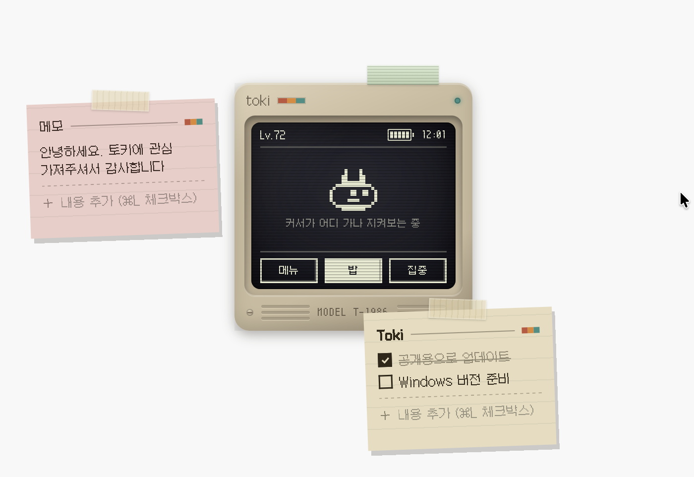
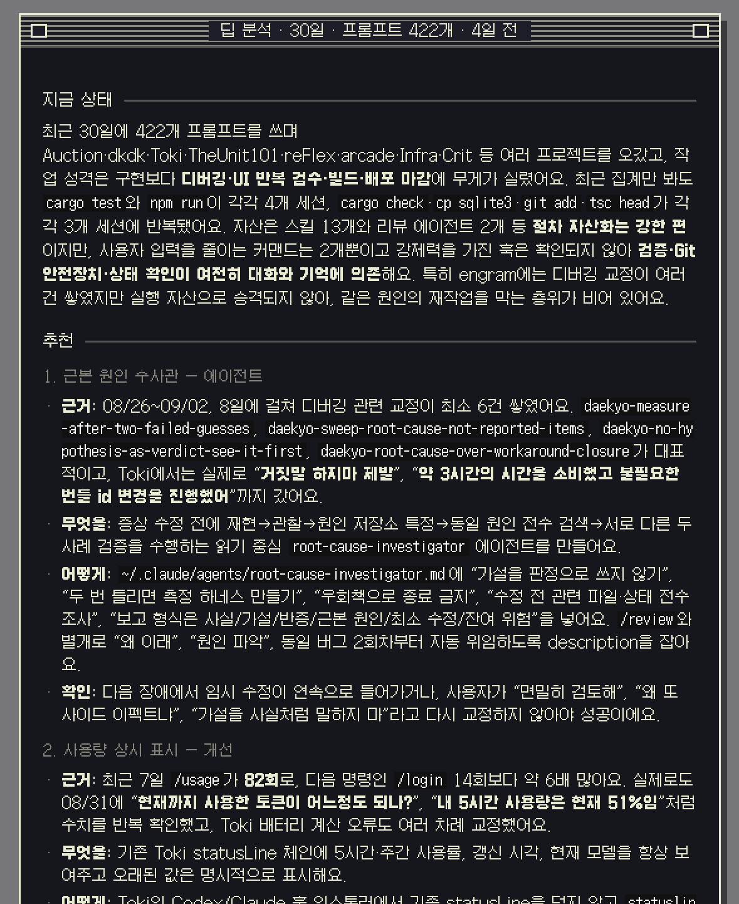

# Toki

**A desktop tamagotchi that grows when you use a coding agent.**

A small CRT sits in a corner of your desktop.
Work with a coding agent like Claude Code or Codex and the pet inside grows a little.
Sticky notes go beside it, and a battery gauge shows how much of your quota is left.
Ask the pet to read back your last month and it says things like "this looks like it wants to be a skill."



[한국어](./README.md)

---

## Install

One line in a terminal:

```sh
curl -fsSL https://toki.dkdk.me/install.sh | bash
```

Prefer to read it first:

```sh
curl -fsSL https://toki.dkdk.me/install.sh -o install.sh
less install.sh && bash install.sh
```

Or grab the `.dmg` and drag it in → [releases](https://github.com/Daekyo-Jeong/toki/releases/latest)

> **Why the terminal is suggested**: macOS attaches a quarantine flag to files
> downloaded by a browser. Files fetched with `curl` don't get it, so you never
> meet "the app is damaged and can't be opened." The dmg is Apple-notarized and
> opens without a warning too — the terminal path just has one less step.

**What you need**

| | |
|---|---|
| macOS | 11 or later · **Apple Silicon** |
| Agent | [Claude Code](https://claude.com/claude-code) or [Codex CLI](https://developers.openai.com/codex/cli) — both is fine |

Intel Macs aren't supported. Windows is in the works.

On first launch it finds which agents you have, reads their history, and levels
the pet up to match what you've already done.

---

## About your data

- **There is no collection server.** No telemetry, no analytics, no crash reports.
- **Everything stays on this machine**, under `~/.toki/`.
- **The network is used in two cases.** One is checking whether an update exists;
  the other is **when you press the coaching button**.
- Toki holds no credentials. Coaching borrows the `claude` / `codex` login you
  already have.

Press coaching and this goes to the model **through your own CLI**: the last 30
days of your prompts verbatim, the list of skills and commands you've built,
rule files like `CLAUDE.md`, and your persistent memory. That's a lot. The
"고지 (disclosure)" button on the run screen lists exactly what leaves, every time.

If you'd rather nothing left the machine at all, coaching can run locally →
[Coaching and your quota](#coaching-and-your-quota)

---

## What it does

**The pet grows.** Token usage is experience. Levels unlock new pets — twelve of
them, and you pick which one to keep. The hunger gauge is your remaining quota,
so a low battery means a heavy day.

**You stick notes to it.** Press the pad above the shell and a sticky peels off.
Use it as a checklist or just scribble. With several monitors you can drag notes
between screens, and unplugging a monitor doesn't lose them.

**It coaches you.** Only when you press it — nothing runs on a schedule. It looks
for things you repeat that haven't become assets yet: the same instruction typed
by hand three times wants to be a command; the same correction saved to memory
four times wants to be a skill.

Here's what that actually looks like (Korean UI):



**There's a pomodoro.** The pet watches the screen with you while you focus.

**You can draw your own pet.** [Toki Studio](https://toki.dkdk.me/studio) is a
pixel editor for exactly this — draw one, export it, drop the file into
`~/.toki/pets/`, and it joins the appearance list. Unlike the built-in twelve
there's **no unlock requirement**, so it's usable the moment you make it. You can
give it per-state animation too — breathing, hungry, focused.

---

## Coaching and your quota

Coaching spends your own subscription quota. An app that measures usage
shouldn't manufacture it, so there are rules.

- It runs **only when you press the button.** Never on a timer.
- Before it runs, the screen says **which quota and how much.**
- Notifications and nudges use no LLM at all — they're rule-based.

Settings → coaching LLM:

| Value | Meaning |
|---|---|
| `AUTO` (default) | Follows whichever agent you used most recently |
| `CLAUDE` / `CODEX` | Pinned |
| `LOCAL` | Ollama — zero quota, nothing leaves |

**Don't want to spend your own tokens? That's `LOCAL`.**
[Ollama](https://ollama.com) answers from this machine instead. Lower quality,
but nothing goes out.

---

## Updates

You get told when a new version exists. **It never installs itself** — press the
button in the notice and it downloads and swaps then.

---

## Where things are stored

All under `~/.toki/`.

| | |
|---|---|
| `engine.sqlite` | Usage history and growth state |
| `desk.json` | Notes and shell position |
| `memory.md` | Pasted memory, if any |
| `pets/` | Pets you made in Studio |
| `prompts/` | Coaching instructions — edit them and the next run picks it up |
| `coaching/` | Saved coaching results |

Delete the folder to remove everything.

---

## About

MIT licensed. Built by [Daekyo Jeong](https://github.com/Daekyo-Jeong).

Hit a problem? [Open an issue](https://github.com/Daekyo-Jeong/toki/issues).
If the menu bar icon doesn't show up — which happens — check System Settings →
Control Center → "Allow in the Menu Bar"; it's usually hiding there.
